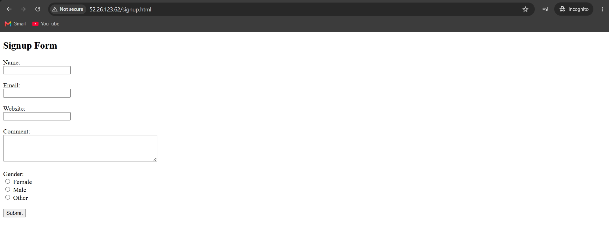
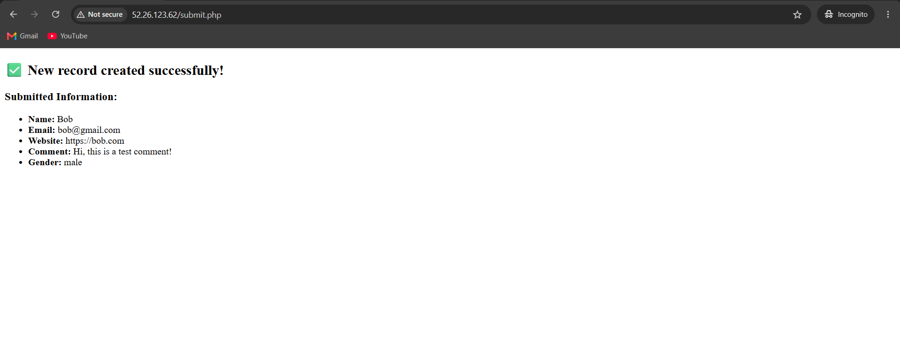

# PHP Signup Form using LEMP Stack





A simple **Signup Form** application built using the **LEMP Stack (Linux, Nginx, MariaDB, PHP)** on an AWS EC2 instance.

The application allows users to submit their information through a signup form, which is then stored in a MariaDB database using PHP.

---

# Technologies Used

- Linux (Amazon Linux)
- Nginx
- PHP
- MariaDB (mariadb105-server)
- HTML5

---

# Prerequisites

Before deploying the application, ensure you have:

- An AWS EC2 Instance (Amazon Linux)
- Security Group allowing:
  - SSH (22)
  - HTTP (80)
- A user with sudo privileges

---

# Step 1: Update Existing Packages

Update all installed packages to their latest versions.

```bash
sudo yum update -y
```

---

# Step 2: Install Required Packages

Install **Nginx**, **MariaDB**, and **PHP**.

```bash
sudo yum install nginx mariadb105-server php -y
```

---

# Step 3: Start and Enable Services

Start the required services.

```bash
sudo systemctl start nginx mariadb php-fpm
```

Enable them to start automatically after every reboot.

```bash
sudo systemctl enable nginx mariadb php-fpm
```

Verify that all services are running successfully.

```bash
sudo systemctl status nginx mariadb php-fpm
```

---

# Step 4: Verify Nginx Installation

Open your browser and visit:

```
http://<EC2-Public-IP>
```

If everything is configured correctly, you should see the default **Nginx Welcome Page**.

---

# Step 5: Deploy the Frontend

Navigate to the Nginx document root.

```bash
cd /usr/share/nginx/html
```

Create the HTML file.

```bash
sudo vim signup.html
```

Copy and paste the contents of **signup.html** from this repository.

Save and exit.

---

# Step 6: Deploy the Backend

Navigate to the same directory.

```bash
cd /usr/share/nginx/html
```

Create the PHP backend.

```bash
sudo vim submit.php
```

Copy and paste the contents of **submit.php** from this repository.

Save and exit.

---

# Step 7: Configure MariaDB

Open MariaDB.

```bash
sudo mysql
```

Set a password for the root user.

```sql
ALTER USER 'root'@'localhost' IDENTIFIED BY '<your_password>';
EXIT;
```

Login using the new password.

```bash
sudo mysql -u root -p
```

Create a database.

```sql
CREATE DATABASE database_name;
```

Select the database.

```sql
USE database_name;
```

Create the users table.

```sql
CREATE TABLE users (
    id INT PRIMARY KEY AUTO_INCREMENT,
    name VARCHAR(100),
    email VARCHAR(100),
    website VARCHAR(500),
    comment VARCHAR(500),
    gender VARCHAR(100)
);
```

Verify the table.

```sql
DESC users;
```

View stored records.

```sql
SELECT * FROM users;
```

---

# Step 8: Install PHP MySQL Connector

Check your installed PHP version.

```bash
php --version
```

Install the PHP MySQL extension.

Example (replace the version if different):

```bash
sudo yum install php-mysqlnd -y
```

or

```bash
sudo yum install php81-mysqlnd -y
```

Restart all services.

```bash
sudo systemctl restart nginx mariadb php-fpm
```

---

# Step 9: Access the Application

Open your browser and navigate to:

```
http://<EC2-Public-IP>/signup.html
```

Fill out the signup form and submit it.

The submitted information will be stored in the **users** table inside the MariaDB database.

---

# Verify Database Entries

Login to MariaDB.

```bash
sudo mysql -u root -p
```

Select the database.

```sql
USE database_name;
```

View stored records.

```sql
SELECT * FROM users;
```

---

# Project Structure

```
signup-form-php/
│
├── signup.html
├── submit.php
├── users.sql
├── README.md
└── .gitignore
```

---

# Features

- User Signup Form
- PHP Form Handling
- MariaDB Database Integration
- Nginx Web Server
- LEMP Stack Deployment
- AWS EC2 Hosted Application

---
